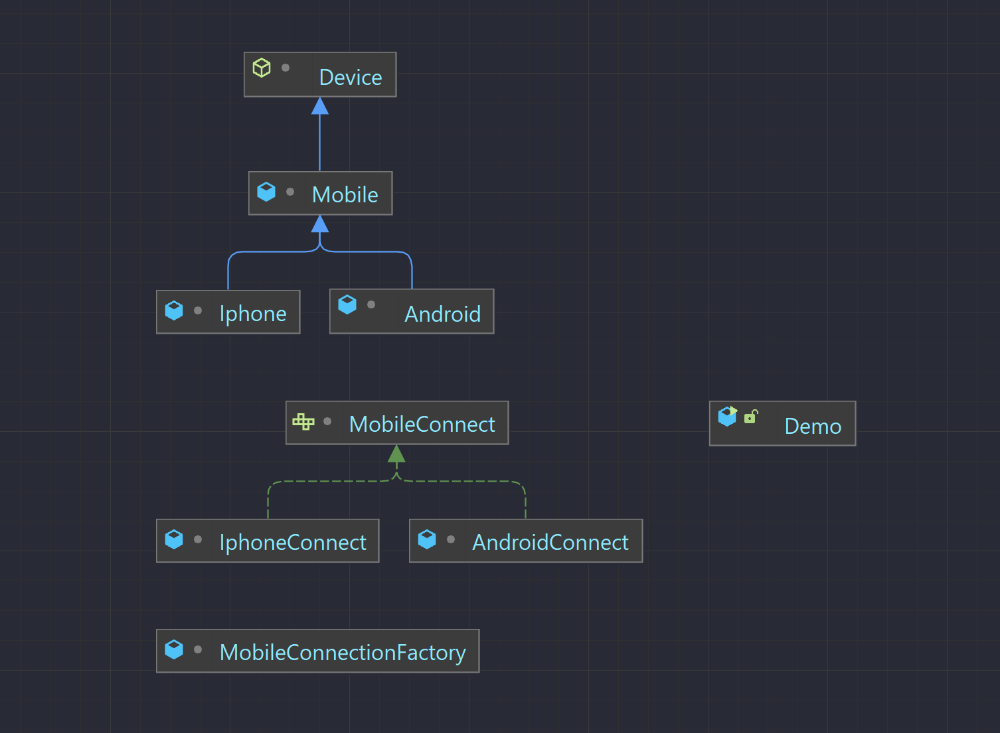

# OOP

## Chương trình Java 4 tính chất của oop và 5 tính chất SOLID
    
    Chương trình có các lớp: abstract Device, Mobile extends Device, Android và
    Iphone extends Mobile
    - Đóng gói: các thuộc tính bên trong class được che giáu bằng private, lớp bên
    ngoài muốn truy cập phải gọi đến get/set
    - Trừu tượng: Định nghĩa lớp trừu trươợng Device với phương thức trừu trượng
    để các lớp kế thừa có thể sử dụng hoặc ghi đè
    - Kế thừa: 2 lớp Android và Iphone kế thừa lại các phương thức và thuộc tính của
    lớp Mobile và có thể tái sử dụng hoặc ghi đè phương thức
    - Đa hình:
        - Nạp chồng: lớp Android có 2 phương thức cùng tên nhưng khác tham số
        - ghi đè: 2 lớp Android và Iphone kế thừa phương thức của lớp Mobile nhưng 
        có thể ghi đè lại phương thức để sử dụng riêng

## Tính chất trong SOLID
    - Single responsibility principle (SRP) – Nguyên lý đơn chức năng
        + Một class chỉ nên giữ 1 trách nhiệm duy nhất, chỉ có thể sửa đổi class với 
        1 lý do duy nhất
        + Tách phương thức connect sang 1 lớp riêng phục vụ mục đích kết nối thiết bị
    - Open-Closed principle (OCP) – Nguyên lý đóng mở
        + Có thể thoải mái mở rộng 1 class, nhưng không được sửa đổi bên trong class
        + Tránh việc sửa đổi class khi muốn thêm 1 phương thức connect từ 1 lớp mới
    - Liskov substitution principle (LSP) – Nguyên lý thay thế
        + Trong một chương trình, các object của class con có thể thay thế class cha 
        mà không làm thay đổi tính đúng đắn của chương trình
        + Các class con đều có thể thay thế được class cha
    - Interface segregation principle (ISP) – Nguyên lý phân tách
        + Thay vì dùng 1 interface lớn, ta nên tách thành nhiều interface nhỏ,
        với nhiều mục đích cụ thể
        + Tách thành các interface nhỏ hơn giúp class không phải ghi đè những phương 
        phức không cần thiết
    - Dependency Inversion Principle (DIP) – Nguyên lý đảo ngược phụ thuộc
        + Các module cấp cao không nên phụ thuộc vào các modules cấp thấp
        Cả 2 nên phụ thuộc vào abstraction
        + Interface (abstraction) không nên phụ thuộc vào chi tiết, mà ngược lại.
        + Các module trong MobileConnectionFactory không phụ thuộc vào các module
        thấp như AndroidConnect mà phụ thuộc và interface, nếu muốn thêm kiểu khác
        chỉ cần tạo lớp và implements interface, đổi kết nối chỉ cần thay đổi trong 
        main mà không phải sửa đổi class
## Khái niệm Interface, Static
    - Interface
        + Toàn bộ phương thức là trừu tượng, thuộc tính phải là hằng
        + Đa kế thừa
        + Không có main và constructor
        + Định nghĩa phương thức không có triển khai
        + Tạo interface khi muốn dựng bộ khung các phương thức
        + Khi class implements 1 interface sẽ thể hiện mối quan hệ has a(có, thực hiện)
    - Static
        + static thuộc về lớp chứ không thuộc và thể hiện của lớp đó
        + Biến static: khởi tạo 1 lần khi tạo class, truy cập trực tiếp qua lớp
        mỗi đối tượng cùng sử dụng chung biến static này
        + Phương thức static: tương tự như trên, pt static chỉ có thể gọi đến 
        phương thức static, biến static khác, không thể ghi đè
## Biểu đồ UMl cho lớp 

## Đọc ghi File
    - Sử dụng FileInputStream và FileOutputStream để đọc ghi theo byte
    - Sử dụng FileReader và FileWriter đọc từng kí tự và ghi vào file 
    - List các file từ 1 directory
    - Đọc nội dung file và in ra
## Code
    - /oop