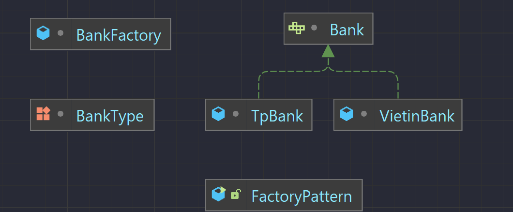
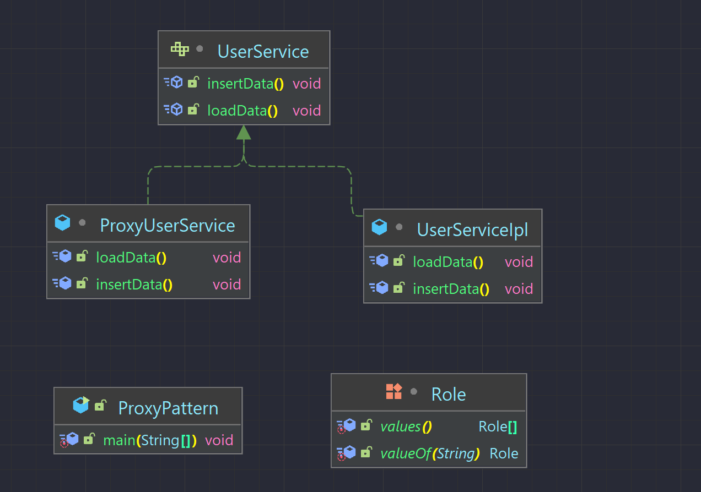
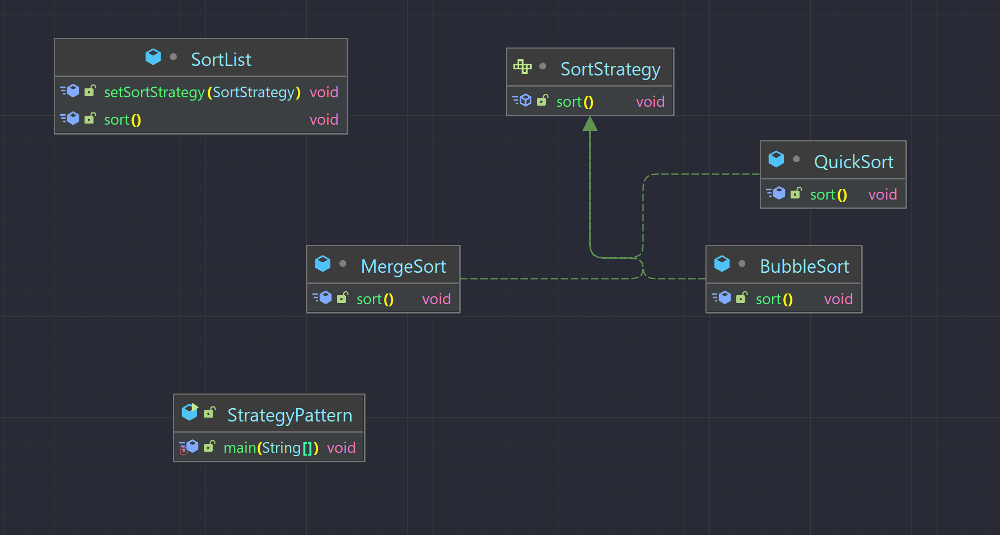

# HashMap, HashSet, Arraylist
## HashMap
    - HashMap lưu trữ dữ liệu dưới dạng cặp key và value
    - Nó chứa các key duy nhất
    - Nó duy trì các phần tử KHÔNG theo thứ tự
    - Khởi tạo HashMap<key, value> hashMap = new HashMap<>()
    - Thêm mới(update) hashMap.put(key,value);
    - Xóa hashMap.remove(key);
    - Lấy giá trị hashMap.get(key)
    - Duyệt phần tử qua iterator hoăc tạo 1 keySet để chửa key
## HashSet
    - HashSet chỉ chứa các phần tử duy nhất.
    - HashSet lưu trữ các phần tử bằng cách sử dụng một cơ chế được gọi là băm (hash table).
    - Khởi tạo HashSet<Object> set = new HashSet<>();
    - Thêm mới set.add(object)
    - Kiểm tra tồn tại set.contains(object)
    - duyệt qua iterator hoặc for each 
## ArrrayList
    - một mảng động để lưu trữ các phần tử
    - Lớp ArrayList trong java có thể chứa các phần tử trùng lặp.
    - Lớp ArrayList duy trì thứ tự của phần tử được thêm vào.
    - Truy cập ngẫu nhiên vì nó lưu dữ liệu theo chỉ mục.
    - Khởi tạo ArrayList<Object> list = new ArrayList()
    - Thêm list.add()
    - Sửa list.set(index, value)
    - Xóa list.remove(index)
## HashCode, Equals
    - sử dụng Các collection để đạt được mục đích của mình cần phải ghi đè lại phương thức equals và hashcode
    - equals so sánh đối tượng về mặt ngữ nghĩa chú không so sánh địa chỉ bộ nhớ như ==
    - hashCode() là mã băm của một phần tử
    - Ví dụ trong Set, collection lưu trữ đối tượng Student
        + Ta ghi đè phương thức equals để so sánh 2 đối tượng Student với nhau, chúng bằng nhau khi có id bằng nhau
        + Nếu chúng ta không ghi đè hashCode cho lớp Student thì khi thêm vào set, mặc dù chúng ta đã định nghĩa lớp
        equals khi 2 dối tượng cho id bằng nhau nhưng do khác hashcode nên trong set vẫn gôm 2 đối tượng giống nhau
        + Cần ghi đè hashcode theo giá trị trong equals để có hashcode bằng nhau
# Design Pattern
    - Mẫu thiết kế giải quyết vấn đề chung, thường gặp trong lập trình
    - Có 3 nhóm:
    - Creation Pattern (Nhóm khởi tạo):Factory Method, Abstract Factory, Builder, Prototype, Singleton. Những Design
    pattern loại này cung cấp một giải pháp để tạora các object và che giấu được logic của việc tạo ra nó
    - Structural Pattern (Nhóm cấu trúc): Adapter, Bridge, Composite, Decorator, Facade, Flyweight và Proxy. Những
    Design pattern loại này liên quan tới class và các thành phần của object. Nó dùng để thiết lập, định nghĩa quan hệ giữa các đt
    - Behavioral Pattern (Nhóm hành vi): Nhóm này dùng trong thực hiện các hành vi của đối tượng, sự giao tiếp giữa các object với nhau.

## Factory Method
    - Định nghĩa Interface để sinh ra đối tượng nhưng để cho lớp con quyết định lớp nào được dùng để sinh ra đối
    tượng Factory method cho phép một lớp chuyển quá trình khởi tạo đối tượng cho lớp con
    - Lớp Factory tạo ra đối tượng theo yêu cầu của chúng ta
    - Tạo đối tượng mà không để lộ logic phía người dùng, tham chiếu đến đối tượng mới bằng interface chung
    - Sử dụng khi có 1 class Cha và nhiều class con, dựa trên đầu vào và trả về 1 trong số chúng
    
    - Tạo ra 2 lớp VietinBank và TpBank ipl Bank ghi đè phương thức getBankName, tạo 1 enum chứa các giá trị mà ngươi dùng ần
    - Tại BankFactory tạo 1 phương thức trả về kiểu Bank truyền vào type, sử dụng switch case để tạo ra lớp đúng với yêu cầu và trả về
    - Khi đó ta che giấu được sự khởi tạo của đối tượng, khi cần 1 đôí tượng Bank với gọi đến phương thức của BankFactory và truyền vào type tương ứng

##  Proxy Pattern
    - Proxy Pattern là mẫu thiết kế mà ở đó tất cả các truy cập trực tiếp đến một đối tượng nào đó sẽ được chuyển hướng vào một đối tượng trung gian (Proxy Class)
    - Cung cấp mức truy cập gián tiếp vào một đối tượng.
    - Tham chiếu vào đối tượng đích và chuyển tiếp các yêu cầu đến đối tượng đó.
    - Proxy và đối tượng đích đều kế thừa hoặc thực thi chung một lớp giao diện
    
    - Khởi tạo interface UserService thực hiện loadData() và insertData(), 2 lớp ipl và proxy triển khai giao diện trên
    - Khi người dùng yêu cầu, 1 đối tượng proxy sẽ được gọi, truyền vào các tham số, vai trò người dùng
    - khi loadData() được gọi, proxy sẽ gọi đến 1 đối tượng userService và gọi đến nó
    - khi insertData() được gọi, proxy sẽ kiểm tra xem có đúng vai trò là Admin nếu đúng thì mới gọi đến lớp chính, không thì sẽ không cho pheps

## Strategy Pattern
    - Giúp tách rời phần xử lý một chức năng cụ thể ra khỏi đối tượng
    - Tạo ra một tập hợp các thuật toán để xử lý chức năng đó và lựa chọn thuật toán nào mà chúng ta thấy đúng đắn nhất khi thực thi chương trình

    - Tạo ra interface SortStrategy với pt sort, các thuật toán sort sẽ ipl lại và triển khai theo các của mình
    - Khi sử dụng đối tượng sortList mà muốn sử dụng các phương thức sort khác nhau ta chỉ cần gọi đến phương thức setSort để có thể
    sắp xếp list đã cho theo kiểu sort đã được định nghĩa
